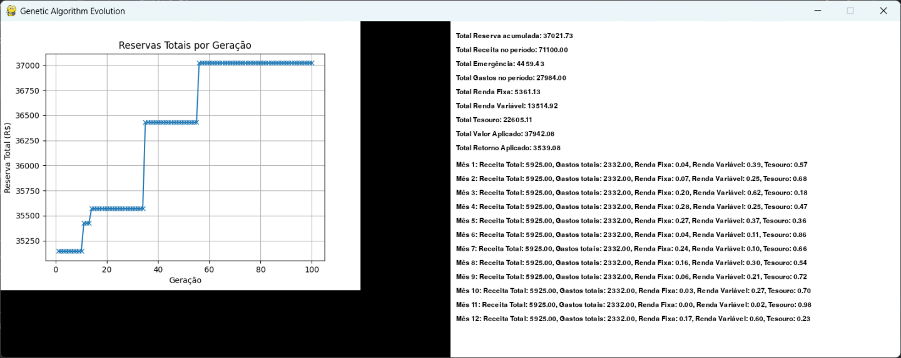

# Planejamento Financeiro Familiar com Algoritmos Genéticos

## Descrição do Problema

O objetivo deste projeto é utilizar algoritmos genéticos para prever o melhor cenário de planejamento financeiro familiar com objetivo de maximizar a reserva financeira ao longo de um período definido.

## Objetivos
Maximizar a reserva financeira total após um período definido, considerando possíveis emergências financeiras.
Definir um limite para gastos mensais

## Estrutura do Projeto

`financial_plan.py`

Este arquivo contém a implementação do algoritmo genético e as funções auxiliares necessárias.

`config.ini`

Este arquivo permite ao usuário definir os parâmetros financeiros e os parâmetros do algoritmo genético.

```ini
[finance]
salario_fixo = 6500
outras_receitas = 500
meta_reserva = 30000
num_meses = 12
max_reserva = 30

[genetic_algorithm]
population_size = 100
ngen = 50
mutation_rate = 0.1
crossover_rate = 0.5
```

#### Parâmetros do Arquivo de Configuração

 - finance
   - salario_fixo: Salário fixo mensal.
   - outras_receitas: Outras receitas mensais.
   - meta_reserva: Meta de reserva financeira a ser alcançada.
   - num_meses: Número de meses para o planejamento.
   - max_reserva: Percentual máximo da renda destinado à reserva financeira.

- genetic_algorithm
   - population_size: Tamanho da população.
   - ngen: Número de gerações.
   - mutation_rate: Taxa de mutação.
   - crossover_rate: Taxa de crossover.

## Execução do Código

Ajuste os valores no arquivo de configuração `config.ini` e execute o script abaixo

> python run.py

### Resultado Esperado

Ao final da execução do algoritmo genético, o melhor plano financeiro será exibido, mostrando a distribuição mensal dos gastos e percentuais de investimentos em renda fixa, renda variável e tesouro. Além disso, será exibida a reserva financeira total após o período planejado.




